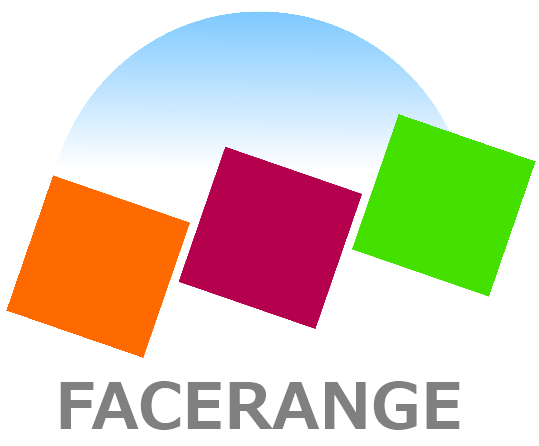
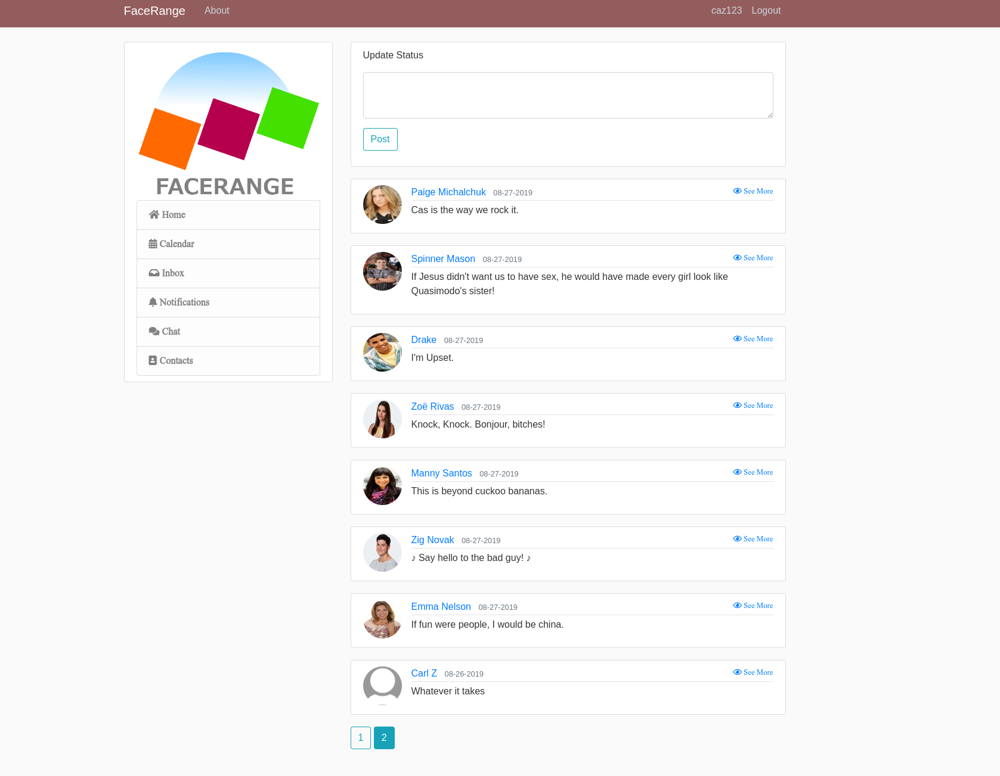

<div id="top"></div>

<!-- HEADER -->
<br />
<div align="center">
    

  <h3 align="center">FaceRange</h3>

  <p align="center">
    FaceRange is a fictional social networking site that is used by numerous characters from Degrassi.
    <br />
    <br />
  </p>
</div>

<!-- ABOUT -->
## About



FaceRange is a fictional social networking site by numerous students/alumni from Degrassi Community School. 
It is the successor to MyRoom, and the second social networking website in Degrassi history. FaceRange is highly similar 
to the social networking site Facebook in the show's universe, like MyRoom is for MySpace. The last known use was Degrassi 
Next Class Season 2, Episode #RiseAndGrind: Mrs. Hollingsworth invites Tristan to a get together on FaceRange.

### Built With

* [Python](https://python.org/)
* [Flask](https://flask.palletsprojects.com/en/2.3.x/)

<!-- GETTING STARTED -->
## Getting Started

### Prerequisites

* [Python 3.9](https://www.python.org/downloads/release/python-390/)
  ```sh
  sudo dnf install python3.9 -y
  ```

### Installation

1. Clone the repo
2. Install the dependencies included in `requirements.txt`
3. Execute `run.py`

<!-- USAGE EXAMPLES -->
## Usage

Flask app will be running on http://127.0.0.1:5000/

You'll need to register and login to view the posts that are recorded in the site.db file.

<!-- CONTRIBUTING -->
## Contributing

Any contributions you make are **greatly appreciated**.

If you have a suggestion that would make this better, please fork the repo and create a pull request.

1. Fork the Project
2. Create your Feature Branch (`git checkout -b feature/MyGreatFeatureRequest`)
3. Commit your Changes (`git commit -m 'Add some features'`)
4. Push to the Branch (`git push origin feature/MyGreatFeatureRequest`)
5. Open a Pull Request

<!-- LICENSE -->
## License

Distributed under the GPLv3 License. See `LICENSE` for more information.

<p align="right">(<a href="#top">back to top</a>)</p>
